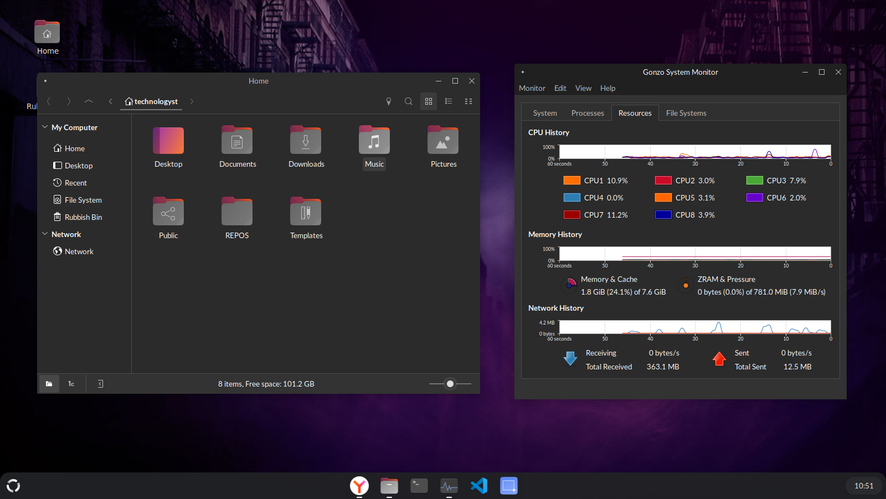
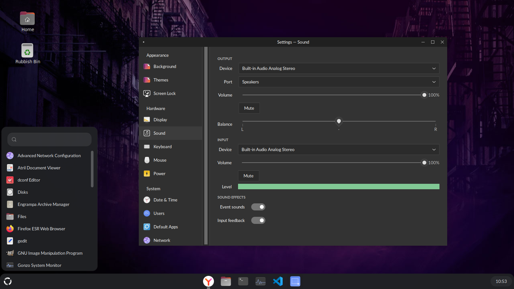

# NuMATE

### MATE, brought into the current century.

NuMATE is a modernisation of the MATE desktop for people who still want a **proper, traditional desktop**.

MATE got the desktop model right. NuMATE keeps that model while bringing the implementation, appearance, and hardware support forward.

No workflow reinvention. No bloat. No web-app desktop. No chasing whatever desktop fashion is currently fashionable.

Just a fast, clean desktop that gets out of your way.

## Why NuMATE?

There is a large group of Linux users who don't want a radically different way of using their computer.

They want:

* A conventional desktop and windowed workflow
* A dock or panel that stays where they expect it
* Straightforward application launching
* Sensible settings
* Familiar interaction patterns
* Modern visual design
* Excellent performance on modest hardware
* A desktop that doesn't require a powerful GPU to feel responsive

NuMATE exists for those people.

It is **MATE modernised, not MATE reinvented**.

## Design

NuMATE takes inspiration from contemporary desktops such as ChromeOS and UKUI while retaining the usability and familiarity that made traditional Linux desktops good in the first place.

The desktop shell uses a clean dock-oriented interface with restrained visual effects, adaptive behaviour and a deliberately compact footprint.

The settings application brings the same philosophy to system configuration: modern presentation without turning basic configuration into an exercise in archaeology.

## Engineering

NuMATE is written in **C** and designed around the principle that a desktop environment should not need a space-age computer to display a few windows.

The goal is simple:

> **It's a desktop, not a space rocket.**

That means keeping the dependency graph sane, avoiding unnecessary abstraction, and paying attention to startup time, memory consumption and responsiveness.

NuMATE is intended to remain comfortable on hardware ranging from modern systems down to machines that other contemporary desktops have long since abandoned.

## Built for the MATE user

NuMATE isn't trying to convince you that the traditional desktop is obsolete.

If you've used MATE for years and thought:

> *"I love this desktop. I just wish somebody would actually modernise it."*

NuMATE is for you.

The familiar desktop metaphor stays.

The outdated implementation doesn't have to.

## Goals

* **Fast** — responsive on everything from modern workstations to genuinely old hardware.
* **Lightweight** — minimal resource consumption and dependency bloat.
* **Familiar** — preserve the traditional desktop workflow.
* **Modern** — contemporary visual design and current hardware support.
* **Native** — native applications and native toolkits; no web-stack nonsense.
* **Portable** — remain independent of any particular Linux distribution or init system.
* **Maintainable** — clean, understandable C code rather than layers of unnecessary abstraction.

## Status

NuMATE is currently under active development.

The project is being built incrementally, with the desktop shell, settings, and supporting components being modernised and consolidated into a coherent desktop environment.

## Philosophy

NuMATE doesn't need to revolutionise the desktop.

It needs to make the boring things **excellent**.

Open the menu.

Launch an application.

Move a window.

Switch windows.

Open a file.

Change a display setting.

Connect to a network.

Adjust the volume.

Lock the screen.

Close the application.

These things should simply work.

**NuMATE — a proper desktop, modernised.**
